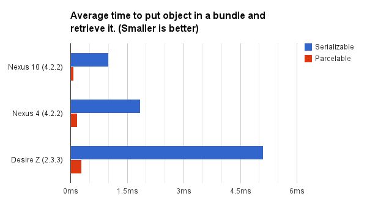

# Android-Fundamental

이 글은 네이버의 노재춘 개발자님께서 주신 질문지이며 제 스스로에게 답을 해보고자 만든 답변들입니다.

## Disclaimer
```
잘못 알거나 모르는 것이 많습니다. 업데이트가 필요한 부분은 MR 을 통해 추가해주시면 반영하도록 하겠습니다.
특히 ? 문자로 시작하는 답변은 틀린 답변일 가능성이 매우 높습니다.
```

### Binder 개념과 Binder에서 발생 가능한 문제

? 프로세스간 통신을 위해서 만든 것
* 모바일 플랫폼에서 기존 Socket 이나 File 입출력을 활용하는 방법보다 더 효율적이고 빠른 프로세스 통신을 위해 만들어짐. 
프로세스간 통신이기 때문에 Binder를 통해 전달할 수 있는 데이터 크기에 제한이 있음.
비지니스 로직이 프로세스가 종료되거나 너무 오랜 시간이 걸리는 경우 RemoteException / ANR등이 발생할 수 있음. 

* 리눅스 커널레벨에서 제공하는 IPC 메카니즘
* 일반적인 IPC 와는 다르게 fd나 shmem같은 OS레벨의 리소스를 공유할 수 있음 
* 원래는 BeOS에서 사용하던 IPC 메카니즘이었지만, OpenBinder라는 프로젝트로 리눅스에 포팅됨. (핵본 여사님 만만세)
* Ref
  * http://events.linuxfoundation.org/images/stories/slides/abs2013_gargentas.pdf?fbclid=IwAR0KZcp6U_HbrriTssmzxESjeAwBPXT_BMA-yJJsFlKr2KPM5PS-q_YA5Uc
  * http://www.angryredplanet.com/~hackbod/openbinder/docs/html/

###  Zygote

? pid 1 을 가진 프로세스로 안드로이드에서 앱의 실행을 관장하는 녀석
* 안드로이드 모든 앱 프로세스는 공통적으로 사용되는 기능 및 로드되는 라이브러리가 있음. 매번 앱 시작시마다 프로세스를 처음부터 만들어서 필요한 초기 작업을 수행하는데 시간이 오래걸림. 이 부분을 가속화하기 위해 공통적으로 사용되는 기능 및 라이브러리를 로드해둔 모 프로세스를 만듬 - Zygote. 다른 앱 프로세스는 해당 프로세스를 fork (clone)하는 형식으로 생성함.
안드로이드 Q 버전부터는 Zygote 대신 common process pool을 유지하는 방식으로 변경됨 (fork에 걸리는 시간을 줄여줌). 따라서 Q 이후에는 Zygote가 없어질 예정. 


* art runtime 구동에 에 필요한 framrwork의 class및 resource를 preload하고 있는 process
* ActivityManagerService의 요청에 따라, uid, 각종 sandbox 설정을 구성한 다음 ActivityThread.main 을 수행해, 앱이 재빠르게 구동되게 도와줌

###  프로세스 우선순위

? 프로세스와 쓰레드에 우선순위를 부여할 수 있으며 이는 동시성 동작시 우선순위 값에 따라서 우선 동작여부가 결정된다.

**by @suribada**
* 질문의도: https://developer.android.com/guide/components/processes-and-threads 문서를 읽어봤는지 확인한다.

  * 답변: 포그라운드/가시적/서비스/백그라운드/빈 프로세스 순서. 빈 프로세스는 캐시 용도로 남아있지만, 가장 먼저 제거될 수 있다.
  * 프로세스 우선순위 때문에 발생하는 문제도 있다. Activity의 onDestroy가 반드시 불린다는 보장이 없는 이유 가운데 하나다.
  * 앱 위젯에서 AsyncTask를 써도 안 되기도 한다. 앱 위젯이 업데이트 안 되다가 앱을 실행하고 나면 업데이트 된다고 문의가 들어오게 된다.
  * 앱 위젯도 BroadcastReceiver라서 onReceive()가 끝나자마자 다른 컴포넌트가 실행되고 있지 않다면 우선순위가 가장 아래로 내려가서 프로세스가 종료될 가능성이 많다.
  * 즉 앱 위젯에서 비동기 동작을 하려면 다시 서비스에 넘겨서 서비스에서 진행해야만 한다.
  * 아래 나오는 질문 가운데 BroadcastReceiver에서 Toast를 띄워도 되는가 하는 것도 프로세스 우선순위를 이해하면 된다.

**by @huewu**
* 안드로이드 플랫폼에서 프로세스 해당 프로세스에서 동작하는 앱 컴포넌트가 사용자의 현재 작업과 얼마나 직접적인 연관이 있는가에따라 결정됨. 예를 들어, 사용자가 현재 사용중인 액티비티는 우선 순위가 가장 높고, 아무런 앱 컴포넌트가 동작하지 않는 프로세스(EMPTY_PROCESS)는 가장 낮은 우선순위를 갖음. 

* 프로세스 우선 순위는 크 게 두가지 방식으로 사용됨. 우선, Low Memory Killer가 메모리 확보를 위해 프로세스를 Kill 해야하는 경우, 우선 순위가 낮은 프로세스부터 Kill함. 두 번째로, 플랫폼 동작 구현 시 프로세스 우선 순위에 따라 동작이 변경될 수 있음. 예를 들어, Doze 모드 진입 시, ForegroundService를 갖고있는 프로세스는 Doze 제약을 피할 수 있지만, 그 보다 낮은 우선순위의 프로세스는 Doze 제약을 받게됨.

### Low Memory Killer와 OOM Killer의 차이

? Low Memory Killer 현재 foreground 어플리케이션이 더 많은 메모리가 필요로 하는 경우 백그라운드의 다른 어플리케이션이나 프로세스를 반환하여 Foreground 앱을 위한 추가적인 메모리를 확보하고자 합니다. 반면 OOM Killer 는 추가적인 메모리 확보가 채 이루어지기 전이거나 더이상 확보할 메모리가 없는 경우에 메모리를 더 할당하는 액션이 발생할 때 해당 프로세스를 종료하도록 합니다.

**by @huewu**
* Low Moemory Killer는 OOM이 발생하기 전에 플랫폼에서 선제적으로 메모리 확보를 위해 프로세스를 종료시키는 것. 따라서 우선 순위가 낮은 프로세스부터 종료하게 됨. Out of Memory Killer는 정말로 allocatae할 메모리 공간이 없을때 발생하며, 프로세스 우선 순위 관계없이 프로세스를 종료할 수 있음. 따라서, 앱 runtime crash나 kernal crash가 발생할 수 있음.  

**Ref**
* https://dalinaum-kr.tumblr.com/post/4528344482/android-low-memory-killer?fbclid=IwAR2m19gh77o9gcX62OFLBNpvJaUWhuG_YRO49poJvKJ9ZJtKXNE5ezGyNbI

### 프로세스 분리 이유 동작

? 주로 상주 서비스 어플리케이션을 선언할 때 많이 이용된다. 상주 서비스는 그 특성상 메모리를 장기간 점유하는데 메인 앱에 종속된 프로세스로 선언하게 되면 메인 앱과 컴퓨팅 자원을 공유하기 때문에 서비스가 의도적이지 않은 상황에 종료할 상황이 매우 빈번하게 발생한다. 이런 경우 별도의 프로세스로 선언하여 적은 메모리로 별도로 동작하도록 한다. 다만 이경우 Preference 등 내부 인터페이스로 멀티 프로세스를 지원하지 않는 자원을 공유하려 할 경우 서로간에 다른 데이터를 공유할 수 있기 때문에 영속성 데이터는 ContentProvider 를 통해서 자원을 공유하는 것이 좋다.

**by @huewu**
* 대표적으로 음악 재생을 위한 포그라운드 서비스를 별도의 프로세스로 분리하는 경우가 많음 (추천됨). 만일 음악 앱이 하나의 프로세스로 이루어져있다면, 다음과 같은 단점이 발생함 
  * UI 상의 오류 혹은 메모리 부족으로 앱 종료 혹은 재시작시 재생중인 음악이 끊길 수 있음. 
  * 사용자가 백그라운드 음악 재생을 위해 앱을 사용하는 경우에도 앱 UI에 관련된 코드들도 모두 메모리에 상주되어 있어야함. 불필요하게 시스템 메모리를 사용하게 됨. 


### Http Call 방법(library?)

초창기에는 Java 의 기본 http api 인 HttpClient 를 많이 사용하였으나 현재는 OkHttp 가 널리 통용되고 있다. OkHttp 는 저수준의 구현체이기 때문에 고레벨의 구현체로 Retrofit 을 많이 사용한다. Retrofit 은 기본동작이 비동기성이며 각 단계별로 다양한 Interface 를 지원하기 때문에 일반적인 Http 를 쉽게 구현할 수 있는 장점이 있다.

### ActivityThread

???

**by @huewu**
* ?Application Main Thread. 

### ActivityThread와 ActivityManagerService간의 통신

??? 아마도...RPC 통신? AOSP 코드 뜯어본 기억에는 AIDL 을 이용한 RPC 통신이다. 과거 이 AIDL 을 스내핑 해서 기기의 전체 앱 Lifecycle 을 모니터하는 서비스를 만든 적이 있다.

### ANR

UI Thread 에서 Network IO, File IO, 반복문 등 지나치게 많은 시간을 소요하게 될 경우 Not Response 로 인한 에러가 발생한다. anr 이 발생한 경우 /data/anr/trace.txt 를 추출하여 어느 쓰레드가 블럭하고 어느 쓰레드가 대기중인지 파악할 수 있다. 일부 기기는 바로 추출이 가능하며 일부 기기는 adb-shell 로 해당 파일을 sdcard 영역으로 복사한 다음 추출할 수 있다.


**by @huewu**
* Main Thread는 메시지 Queue 형식으로 동작. 해당 Queue에서 일정 시간내에 작업이 완료되지 않으면 ANR이 발생함. ANR이 발생하는 기준은 Main Thread에서 동작하고 있는 Application Component에 따라 조금씩 달라짐. 예를들어 Activity의 경우 5초. Broadcast Receiver의 경우 조금 더 긴 경우가 많음 (10초)

**by @ted**
- Application Not Responding의 줄임말
- 화면을 터치하고나서 5초안에 응답이 없는경우 발생함
: BroadcastReceiver의 이슈도 있지만 대부분의 경우는 위의 이유때문
- 백그라운드로 돌릴법한 무거운 작업을 UI쓰레드에서 돌리는 경우에 발생함
- 예전에 서버통신을 할때 UI쓰레드에서 돌리면 이런 에러가 발생했었고 AsyncTask를 쓰더라도 제대로 처리해주지 않으면 문제가 발생했었음
: 요즘에는 친절하게 UI쓰레드에서 하지 말라는 메세지와 함께 에러를 발생시켜줌
- RxJava, Coroutine에서 쓰레드 스케줄러 관리를 작업에 맞게 잘 전환 시켜줘야 하는 이유이기도 함


### Looper/Handler/MessageQueue

특정 쓰레드에서 동작하도록 실행할 수 있는 외부 인터페이스로 Handler 가 있으며 이 Handler 는 선언하는 시점에 Thread 에 종속된다. Handler 를 통해 동작하는 Runnable 객체를 전달하면 이는 Message Queue 에 담겨져있다가 Looper 가 Queue 에서 하나씩 객체를 꺼내서 동작하도록 한다.

### Looper는 몇 개?

Thread 당 1개

### Message object pool, Message.obtain 쓰는 이유.

? Message 가 Handler 에 종속되었음을 선언하기 위함

**by @huewu**
* 모든 UI Event 및 대부분의 System 상호작용은 Message 형태로 처리됨. 따라서, Message Ojbect는 매우 많이 그리고 자주 사용됨. 이 때 매번 작은 오브젝트를 생성하고 삭제하면 시스템 성능에 악영향을 줄 수 있음. 따라서 너무 빈번한 Message object 생성 및 삭제를 방지하기 위해, Object Pool 형태를 유지해 Message object를 재활용.

###  pool의 개수
???

**by @huewu**
* Application Process당 1개? 

###  pool은 어디에 어떤 형태로?
???

### Handler 용도

일반적인 용도는 Background Thread 에서 UI Thread 로 동작을 전환하고자 할때 Handler 가 메세지를 받아서 처리하도록 한다.

**by @huewu**
* LooperThread에 연결된 Looper로 Message를 전달하고 (sendMessage), 전달된 Message를 처리하는 역할(handleMessage). 또한 Messenger 형태로 감싼 후 다른 Process로 전달되어 IPC 채널을 만드는데도 사용될 수 있다.

### ViewParent, getParent

???

### ViewRootImpl의 용도는?

???

### AsyncTask 사용 시 문제점

ICS 이전의 경우 AsyncTask 가 버전별로 ThreadPool 관리, 동시성 다중처리 등이 균일하지 않아 OS 버전별로 의도된 동작이 달랐으나 현재는 Min-SDK 가 ICS 이후기 때문에 이러한 문제를 만날 가능성은 없어졌다.

고전적인 이슈는 inner class 로 선언했을 때 발생하는 메모리 릭과 Lifecycle 에 의한 제어 처리가 미흡 할 수 있다는 것이다. anonymous inner class 로 선언한 경우 일반적인 실수가 View 객체레 바로 접근한다는 문제가 있다. 이 경우 해당 Activity/Fragment 가 종료 되어도 순환 참조로 인한 메모리 릭이 발생할 수 있다. 또한 화면이 종료되어도 AsyncTask 를 별도로 종료하지 않는다면 의도치 않게 컴퓨팅 리소스를 사용하게 된다.

### AsyncTask 취소

? AsyncTask.cancel()?? 하지만 이경우 Thread-Interrupt 가 발생 하기 때문에 만약 doInBackground 에서 for-loop 와 같은 반복문이 있다면 반복문 내부에 Thread 가 종료되었는지 확인하는 추가코드가 필요하다.

### mayInterruptIfRunning의 의미

???

### HandlerThread란?

???

**by @huewu**
* Message를 처리할 수 있는 Looper가 있는 Thread?


### deep sleep 현상은 무엇이고 이에 대한 대책은?

? Doze 모드??? 

### Context는 어떤 데 쓰이고 자식 클래스는 어떻게 되나?

? 주로 앱 전체 리소스나 시스템 리소스에 접근, 화면이나 특정 상황에 정보에 접근할 때 사용한다. ActivityContext, ServiceContext, BroadcastContext, ApplicationContext

### Activity에서 this, getBaseContext(), getApplicationContext() 차이

? Activity 는 내부적으로 ContextWrapper 를 사용하며 이는 ActivityContext 이다. ActivityContext 는 Activity 가 종료되면 더이상 리소스 접근이나 View 생성등에 제약사항이 발생하기 때문에 리소스 접근을 위한 경우에는 ApplicationContext 를 사용하는 것이 좋다.

### ActivityA에서 ActivityB 호출한 경우 생명주기/ActivityA로 다시 돌아오는 경우 생명주기

A Pause -> A Stop -> B Create -> B Start -> B Resume -> B Pause -> B Stop -> B Destroy -> A Start -> A Resume

단 B 동작 중 A 가 반환되어 re-create 가 발생한다면 B Stop 후 A Create -> B Destroy 가 된다. (왜냐고 묻는다면 모릅니다. 로그 보면 그렇더군요...)

---
(ted)
- 제가 면접에서 꼭 물어보는 질문(많은 사람들이 쉽다고 생각하지만 실제로는 생각한것과는 많이 다르게 움직이는 라이프사이클)
- `startActivity()`발생시
```
[A]onPause
[B]onCreate
[B]onStart
[B]onResume
[A]onStop
```
- 뒤로가기 등으로 B가 종료되는 경우
```
[B]onPause
[A]onRestart
[A]onStart
[A]onResume
[B]onStop
[B]onDestroy
```

### onSaveInstanceState() 실행 시점

onStop 후 호출
- Activity가 여러 이유(Orientation이 바뀌는 경우, 백그라운드에 있다가 종료되어야 하는 경우 등)로 상태값을 저장해야하는 경우에 호출됨
- 저장될때는 `onSaveInstanceState()`, 다시 불러올때는 `onRestoreInstanceState()`가 호출됨
- 통상적으로 onCreate()에서 아래와 같은 경우에 따라 다른 분기처리를 함
```
- savedInstanceState != null: 이전에 어떠한 이유로 상태가 저장된 경우가 있으므로 savedInstanceState로부터 값을 가져옴
- Intent.ACTION_VIEW == intent.action: 딥링크를 통해 화면이 시작되었으므로 getQueryParameter()를 통해 값을 가져옴
- 그외: startActivity()를 통해 화면이 실행되었으므로 intent로 부터 값을 가져옴
```
- savedInstanceState처리가 잘 되는지 테스트하는 방법
```
- 가로/세로 orientation을 바꿔가면서 테스트
- [개발자 옵션]-[백그라운드 프로세스 수 제한]-[백그라운드 프로세스 없음]설정
```
### taskAffinity 동작
- 스파이더맨에 나오는 MCU세계관 멀티버스와 비슷한 개념으로 생각하면 편함
- 기본적으로 앱안의 모든 Activity들은 같은 taskAffinity를 가짐
- Manifest에서 activity의 taskAffinity를 개별로 지정해줄수 있음
- 예를들어 A,B Activity가 같은 taskAffinity를 가지면 A가 백그라운드에 있다가 B가 실행되면 A도 같이 실행되지만, 다른 taskAffinity를 갖는다면 A가 백그라운드인 상태에서 B가 실행되도 A는 여전히 백그라운드에 존재함
: [삼성 '스마트매니저' 푸시알림 차단이슈 대응하기](https://gun0912.tistory.com/64)에서 사용된 taskAffinity 참고

### singleTask, singleInstance 차이

? SingleTask : 1개 액티비티만 있도록 한다. CLEAR_TASK + NEW_TASK 와 유사

? SingleInstance : 동일한 액티비티는 1개만 있도록 한다. BRING_TO_FRONT 와 유사

### Fragment 쓰면 장점, 불편한 점

Activity 가 반환되었다가 re-create 동작이 될 때 Fragment 도 함께 복구 되는데 이때 간혼 Fragment 가 onSavedInstance 관련 동작 이전에 다른 동작은 한다고 Crash 를 낸다. FragmentTransaction 에서 commit 할 시 간혹 에러가 발생한다. 이를 위해 state loss 를 허용하는 API 가 추가로 만들어졌다.

### Fragment 정적 생성 메서드를 쓰는 이유

생성자를 override 해서 할 경우 restore 동작시 특정 값이 유실될 수 있다. 그래서 생성자는 override 해서는 안되며 Extra 형태로 값을 추가해서 restore 시에서 해당 값이 복원된 상태에서 처리될 수 있도록 해야한다.

- Fragment가 여러가지 이유에서 새로 만들어지는 경우 무조건 기본 생성자가 호출됨
: XXXFragment의 생성자에 userId를 넘기도록 만들었어도 XXXFragment의 기본생성자가 불림
- 그러므로 정적 메서드를 활용해서 기본 생성자를 만들고 bundle에 argument를 넘기는 방식으로 만들어야함
- 통상적으로 정적 메서드 이름은 `newInstance()`로 만들어서 사용함

### 서비스는 언제 사용?

기본 용도는 백그운드 동작을 위해 쓰여지며 단발성인 경우 IntentService 를 사용 할 수 있다. 내부에서 Queue 를 관리하기 때문에 Download 처리나 특정 프로세싱 등을 위한 처리로 이용할 수 있다. 장시간 머무르며 동작해야하는 경우 Service 를 사용하면 된다. 주로 TCP 연결 후 서버와 데이터 처리시 많이 사용하였다.

### 시스템 서비스와 서비스 컴포넌트 차이점

???

### Service onStartCommand 리턴 값 구분

? 반환시 자동재실행, 반환시 끝 이 있다.
- 어떤 값을 return하느냐에 따라서 서비스가 나중에 재시작될때 intent를 어떻게 처리할지 정할 수 있음
#### START_STICKY 
- 대부분의 경우에 쓰임
- 서비스가 종료되고 나서 시작될때 intent는 null로 내려옴
: 대부분 여기서 intent null처리를 하지 않아서 죽는경우가 발생함
#### START_NOT_STICKY 
- 서비스가 죽어도 다시 시작되지 않음
- 주로 batch작업같은 주기적으로 체크하거나 작업이 도는데 서비스가 죽어도 괜찮은 경우에 사용
#### START_REDELIVER_INTENT 
- 서비스가 다시 시작될때 이전에 전달받았던 intent를 다시 가져옴
- 서비스가 중간에 멈추더라도 처음에 실행했던 작업을 무조건 다시 시작해서 완료해야 하는 경우에 사용

### Started & Bound Service 언제 쓰이나?

? Bound Service 특정 ServiceBinder 가 연결을 요청한 경우 연결되며 Binder 가 종료되면 Service 도 함께 종료된다. 서비스에서 특정 처리를 한 경우 직접 통신을 하고 싶을때 쓴다.

### BIND_AUTO_CREATE 옵션은 왜 쓰나?

? Binder 요청시 서비스가 자동으로 실행하도록 하기 위해??

### IntentService

1번에 1개의 동작을 목적으로 하며 내부에서 Service 가 Queue 를 관리하여 도작한다.

### aidl 스텁과 프락시

? 다른 프로세스로 선언된 서비스와 직접 통신하고 싶은 경우 사용

### 서비스와 Activity 통신 방법은 어떤 것들이?

? Binder, 동일한 프로세스라면 Application level Singleton, ContentProvider, Sqlite 를 활용한 MessageQueue 구현 후 polling 처리

### cp와 직접 db 접근 코드 선택 기준

ContentProvider : 다른 프로세스나 인터페이스를 공유하지 않는 모듈간에 데이터를 교환해야할 때

DB : 같은 앱 - 해당 DB 를 접근할 수 있는 동일한 레벨의 모듈/프로세스간, 다른 앱 - DB 파일의 위치를 명시적으로 알 수 있는 경우

### db lock이란?

멀티쓰레드 환경에서 동일한 DB/테이블에 접근한다면 데이터의 무결성이 깨질 수 있다. 이를 위해 1번에 1개의 레코드에 접근할 수 있도록 해야한다.

### db transaction의 장점과 문제

? db 처리중 에러 발생시 자체 rollback 가능하나 commit 명령이 호출되는 순간 다른 접근자는 대기 상태가 되며 commit 이전에는 변경이전의 데이터를 바라볼 수 있다.

### BroadcastReceiver에서 Toast를 띄우면?

Crash. BroadcastReceiver 는 UI Thread 에서 동작하지 않기 때문에 명시적으로 Handler 를 통해 Toast 를 호출해야한다.

질문 의도: 프로세스 우선순위를 이해하고 있는가이다.
테스트를 해보지 않으면 알기 어렵다.
Yes라고 해도 안 되고 No라고 해도 안 된다.

답변: Toast는 뜰 때도 있고 안 뜰 때도 있다.
BroadcastReceiver의 onReceive() 메서드 자체는 UI 스레드에서 동작한다.
그래서 Toast가 잘 뜰 거 같은데, 조건에 따라 다르다.
앱에 실행중인 컴포넌트 예를 들어 Activity가 포그라운드에 떠있거나 하면 프로세스 우선 순위가 높기 때문에
BroadcastReceiver에서 Toast도 잘 뜬다.
다른 컴포넌트가 실행중인게 없이 어디선가 브로드캐스트를 해서 BroacastReceiver만 달랑 실행될 때는 
문제가 발생할 수 있다. Toast 자체는 비동기 동작이기 때문에 BroadcastReceiver의 onReceive() 실행중에는 우선순위가 높지만 끝나자마자 프로세스 우선순위가 떨어져서 프로세스는 종료될 수 있다.
이때는 Toast가 뜨지 못한다.

### LocalBroadcastManager 역할

? AndroidManifest 에 선언하지 않은 앱내에서 registerReceiver 로 등록된 리시버를 관리하고 이벤트를 전달한다.

### Application의 용도

앱 최초 실행시 필요한 처리 초기화. MultiDex 초기화.

- 앱이 실행되고 있는한 무조건 존재한다고 판단할 수 있는 클래스
- 대부분 singleton형태로 Application클래스를 활용함
- context가 필요한경우 Application의 클래스를 활용해서 사용함
: UI가 필요한 context인 경우는 Application의 context를 사용하면 안됨
- 여러 화면에서 필요한 변수나 값을 static변수로 선언해서 사용하지 않고 Application의 필드로 선언해서 가져다 사용하게 하는 패턴도 있음
: 하지만 너무 남용하면 안되므로 추천하지는 않음. repository패턴을 사용하거나 intent등의 다른 우회의 방법으로 데이터를 공유하도록 해야함

### SharedPreferences commit()과 apply() 차이

Commit : 동기식, Apply : 비동기식. 

? SharedPreference 는 파일을 한번 읽은 후 메모리에서 관리하였다가 파일에 다시 저장하는 방식이다. Commit 은 파일에 까지 기록을.. Apply 는 메모리에만 갱신하고 파일에는 어느 시점에 bulk 로...

### google play service 연결은 어떻게 하는가? 내부 구조

???

### Parcelable/Serializable 차이

??? Parcel 은 Android 에 필요한 몇가지 처리가 더 되어 있다고 한다. 또한 Intent 에 담아서 전달할 때 Serializable 보다 더 가볍다고 한다.

- Serializable은 Java에서, Parcelable은 안드로이드에서 추가된 개념
- Serializable로 만드는건 Serializable을 implements만 해주는 코드를 넣으면 되서 엄청 간단하지만 refelection을 사용하기 때문에 무거움
- Parcelable로 만드려면 귀찮은 작업을 해주어야 하지만 안드로이드 스튜디오의 플러그인에서 코드를 알아서 만들어 주는게 있어서 편함
: kotlin을 사용한다면 @Parcelize 를 붙여주면서 엄청 간단하게 Parcelable처리 가능
- 안드로이드 모두 Parcelable, Serializable를 사용할 수 있지만 Parcelable의 속도가 훨씬 빠름

- 개인적으로 안드로이드에서 Parcelable안쓰고 Serializable을 사용하는 코드를 극혐

### 메모리릭 확인하는 방법

Leak Canary, Profiler, dumpsys

### targetSdkVersion 용도

앱을 특정 sdk api 에 맞춰서 빌드한다.

질문 의도: compileSdkVersion, minSdkVersion과 구분을 하는가?

답변: 그 버전까지는 호환성 모드를 쓰지 않겠다는 의미다. 호환성 모드는 안드로이드 버전이 올라가더라도 앱의 기존 동작이 바뀌는 것을 방지하기 위한 것이다.
예를 들어 AsyncTask 병렬 실행이었다가 순차 실행으로 바뀌었는데, targetSdkVersion를 올리지 않으면 
기존과 동일하다.


### 싱글톤에 Context가 그대로 전달되면 어떤 문제가 생기는가? (코드로 만들기)

??? ApplicationContext 면 ok. 그외의 Context 면 메모리릭.

Singleton.context = context.getApplicationContext() 로 해줘야 함.

### 아래 코드의 실행 결과는?
```
for (int i = 0; i < 4; i++) {
  title.setText("current=" + i);
  SystemClock.sleep(1000);
}
```

??? 아마도 화면이 1초씩 끊기며 업데이트?

질문 의도: 문제 있는 코드라는 걸 알고 있는가?
UI에서 일정 시간 간격으로 UI를 업데이트는 패턴을 알고 있는가?

```
Runnable updateRunnable = () -> {
    current++;
	title.setText("current=" + current);
	if (current < 4) {
		handler.postDelayed(this, 1000);	
	}
}


public void onClick(View v) {
	handler.post(updateRunnable);
}
```

답변: 
메인 스레드를 블로킹 하기 때문에 1초마다 출력이 되지 않는다.
5초후에 current=4만 출력된다.
setText()는 결국 invalidate() 메서드를 호출하면서 MessageQueue에 다시 그리도록 명령하는데,
그렇다면 MessageQueue에 5번의 invalidate() 메서드 호출로,
눈에 보이지 않는 순식간에 current=0, current=1, ..., current=3까지 하고서 최종 current=4까지 되는 것은 아닐까 생각할 수도 있는데, invalidate() 내에서 플래그가 있어서 한번만 그리기를 한다.

======= 일반 =====

### State 패턴과 Strategy 패턴 차이

### 마커 인터페이스

? IntRes, Nullable, VisibleForTesting 이런거?


### 애너테이션 활용은?

특정 변수나 함수, 클래스 등에 대한 명시적으로 추가정보 입력. APT (Dagger), Proxy (Retrofit), Lint (SupressWarning, VisibleForTesting) 등등 

### AOP 장단점?

장점 : 공통적인 전처리, 후처리에 대한 처리가 편하다. 

단점 : 설정이 빡세다. 모든 처리에 공통 동작이 추가 되기때문에 성능에 영향을 준다.

### 스레드풀 AbortPolicy

???

### CountDownLatch 사용. 주의할 점

? 카운트가 0 이 될때까지 기다리도록 한다. 다른 쓰레드가 카운트 다운을 실행하고 wait 하는 쓰레드는 0 이 될때까지 기다린다. 0 이 되면 재사용 안되니 주의.

### enum은 어떤 때 쓰는가?

? 특정 상태를 Primitive 타입이 아닌 명시적으로 선언하고자 할때

### for each 내부 구조는?

Array/Collection -> iterator 로 변환된다. 따라서 for-each 도중 데이터의 size 가 변경되면 에러가 난다.

### 다이나믹 프록시는?

특정 인터페이스를 선언하고 Proxy 를 사용하여 Method Invoker 를 통해서 사전 정의된 동작을 하도록 한다. 대표적인 예 : Retrofit

======== RxJava ===

### Subject 문제점과 어느 때 사용하면 되는가?

외부에서 데이터를 전달해야할 경우 Subject 는 HotObservable 이기 때문에 downstream 의 처리 용량에 대해서 관여하지 않고 데이터를 계속 밀어준다. 따라서 BackPressure 이슈가 동반된다.

### Scheduler와 Worker의 관계

???
Scheduler 는 특정 쓰레드를 명시하는 것이며 Worker 는 쓰레드에서 실제 동작을 수행하며 처리, 딜레이, dispose 등 직접적인 처리를 한다.

### subscribeOn/observerOn 차이

subscribeOn 는 해당 스트림의 상위 스트림이 생성되는 시점의 쓰레드를 선언한다. observeOn 는 데이터가 보내진 다음 downstream 이 동작할 쓰레드를 선언한다.
- 통상적으로 `subscribeOn()`, `observerOn()`를 한쌍으로 같이 사용하는데
`subscribeOn()`는 그 짓을 할 놈의 쓰레드, `observerOn()`는 그 짓의 결과를 받을 놈의 쓰레드정도로 생각할 수 있다.
- Rx에서 `flatMap()`, `filter()`등의 여러 operator를 활용해서 chaining을 할때 `observerOn()`을 잘 활용해서 쓰레드를 전환시켜서 해당 작업에 맞는 적절한 쓰레드 작업을 시켜주도록 할 수 있다.